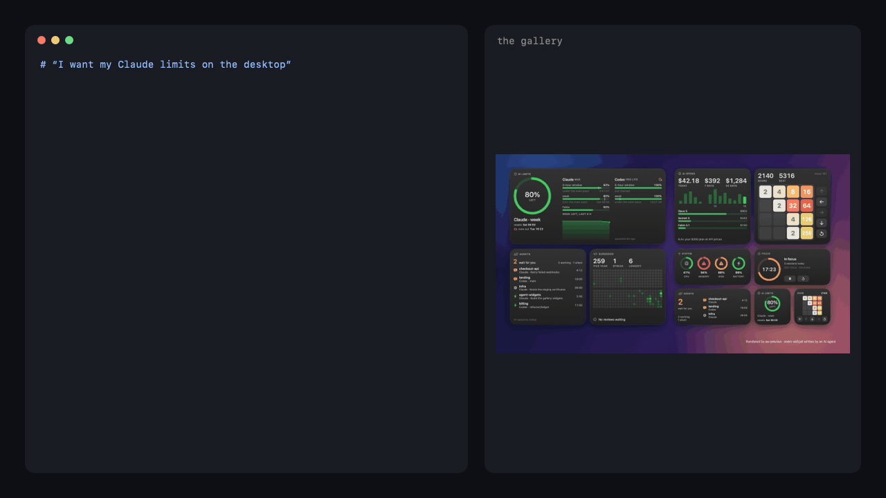
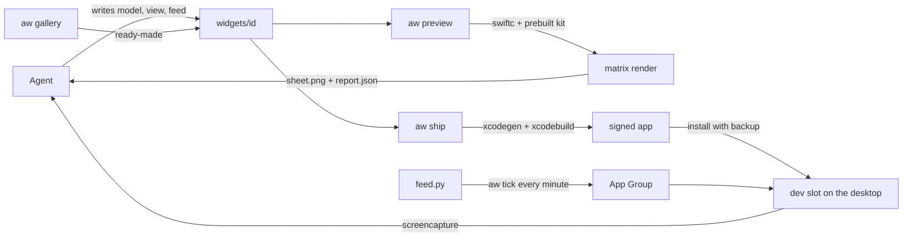

<p align="center">
  
</p>

<h1 align="center">agent-widgets</h1>

<p align="center"><b>Native macOS desktop widgets, built by your AI agent.</b></p>

<p align="center">
  <a href="https://github.com/Surdeddd/agent-widgets/releases"></a>
  <a href="https://www.npmjs.com/package/agent-widgets"></a>
  <a href="https://github.com/Surdeddd/agent-widgets/actions/workflows/ci.yml"></a>
  
  
  
</p>

<p align="center"><a href="README.ru.md">Русская версия</a></p>

Say what you want to see on your desktop. Your agent — Claude Code, Codex, Cursor, Claude Desktop — writes a small SwiftUI view and a feed script, and `aw` turns them into a real WidgetKit widget: it renders every size and theme with layout checks, builds and signs the app, installs it and shows the agent a screenshot of the real desktop, so it can fix what it sees.

Or skip the writing: seven widgets are ready to install.

## Your AI limits on the desktop in a minute

<p align="center">
  
</p>

```sh
brew install surdeddd/tap/agent-widgets     # or: npm install -g agent-widgets
aw init ~/Widgets && cd ~/Widgets
aw gallery add ai-limits && aw feed run ai-limits && aw ship ai-limits
```

Or tell your agent: *“I want my Claude and Codex limits on the desktop”* — with the MCP server connected it finds the gallery by itself.

## Gallery

`aw gallery` lists them, `aw gallery add <id>` copies one into your workspace with its feed, samples and tests. Every widget is plain SwiftUI and Python you can read and change. The images are `aw preview` renders; AI limits, GitHub and System pulse show live data, the rest their samples.

**[ai-limits](examples/widgets/ai-limits)** — what is left of your Claude and Codex windows, when they reset, how fast you burn them against an even pace, when you run out at this rate and a week of history. It asks Anthropic for your own usage with the login Claude Code already has and reads the Codex limits from its local logs — no third party, no extra key.


**[agents](examples/widgets/agents)** — which Claude Code and Codex sessions wait for you, went silent or are working, with live timers and the sessions of the last hours.


**[github](examples/widgets/github)** — your contribution year, the streak, the review queue and the last 14 days, through the `gh` CLI you already use.


**[ai-spend](examples/widgets/ai-spend)** — what your Claude Code tokens would cost at API prices: today, the week, the month, by model, and how many times over your plan pays for itself.


**[tiles](examples/widgets/tiles)** — 2048, played right on the desktop: every arrow is a full move, no app opens.


**[system-pulse](examples/widgets/system-pulse)** — CPU, memory, disk and battery with a warning you can read without color.


**[focus](examples/widgets/focus)** — a Pomodoro timer you start, pause and reset from the widget.


## Build your own

Coding agents write good SwiftUI, but they cannot see WidgetKit. `aw` gives them eyes and hands. The agent writes only what is unique — a Codable model, a view and, for live data, a feed — and gets an answer it can act on.

<p align="center">
  
</p>

- **A preview the agent can trust.** Every family × light / dark / idle desktop / Tahoe clear glass × sample, at this Mac's real widget sizes, in about a second, with `OVERFLOW`, `TRUNCATION`, `DECODE` and other checks. Every issue comes with a hint, and `aw explain` goes deeper.
- **Big widgets that earn their size.** The preview measures the largest empty area of every size and warns with `UNDERFILLED`; the skill teaches a ladder — each size answers a bigger question — instead of one layout stretched four ways. On the same brief a fresh agent went from 71 % of an extra large widget empty to 15 %.
- **Real WidgetKit, not a mockup.** `aw ship` builds a signed app, swaps it into `/Applications` with a backup, points the dev slot at the widget and screenshots the real window.
- **Live data that respects the budget.** Feeds in any language print JSON; `aw` checks it against the model, publishes only real changes and schedules feeds with a LaunchAgent. A change reaches the desktop about a second after it is published.
- **Interactive widgets.** Buttons with state — moves, toggles, counters, shuffled decks — that do not spend the reload budget.
- **Made for agents.** An MCP server whose preview tool returns the sheet as an image and whose long calls hand back a job id instead of timing out, a skill with components, recipes and gotchas, and a Claude Code plugin that installs both at once.
- **Bilingual.** Every message, every widget and every doc in English and Russian.

```sh
aw new weather --template metric
aw preview weather        # writes .aw/previews/weather/sheet.png
aw ship weather           # build, install, dev slot, real screenshot
```

The first time, add “<App name> · Dev” to your desktop: right-click the desktop → Edit Widgets → search for the app. From then on `aw ship` and `aw dev` switch that slot to whatever you are building.

## Install

| | |
|---|---|
| **Homebrew** — builds from source with your Xcode | `brew install surdeddd/tap/agent-widgets` |
| **npm** — a prebuilt universal binary | `npm install -g agent-widgets` |
| **Claude Desktop** — one file, no terminal | download `agent-widgets-<version>.mcpb` from the [latest release](https://github.com/Surdeddd/agent-widgets/releases/latest) and open it |
| **From source** | `git clone https://github.com/Surdeddd/agent-widgets && cd agent-widgets && make install` |

Then `aw doctor` checks the rest.

**Requirements:** macOS 14 or newer, Xcode 16.3 or newer, `brew install xcodegen`, and an Apple Development certificate — a free Apple ID is enough, no paid membership: Xcode → Settings → Accounts → + → Apple ID, select its “(Personal Team)” → Manage Certificates → + → Apple Development; in an existing workspace then run `aw init --refresh-signing`. Widgets need the certificate for their App Group; `aw preview` works without it. Every widget in this repository was built, signed and installed with a free Personal Team.

## Use it from an agent

**Claude Code** — the plugin brings the skill and the MCP server:

```text
/plugin marketplace add Surdeddd/agent-widgets
/plugin install agent-widgets@agent-widgets
```

Without the plugin: `aw skill install` and

```sh
claude mcp add -s user agent-widgets -- npx -y agent-widgets mcp --workspace ~/Widgets
```

**Codex** — `~/.codex/config.toml`

```toml
[mcp_servers.agent-widgets]
command = "npx"
args = ["-y", "agent-widgets", "mcp", "--workspace", "/Users/you/Widgets"]
```

**Cursor** (`~/.cursor/mcp.json`), **Gemini CLI** (`~/.gemini/settings.json`) and any other MCP client

```json
{
  "mcpServers": {
    "agent-widgets": {
      "command": "npx",
      "args": ["-y", "agent-widgets", "mcp", "--workspace", "/Users/you/Widgets"]
    }
  }
}
```

With `aw` installed by Homebrew or from source, use `"command": "aw", "args": ["mcp", "--workspace", "…"]` instead. The server is listed in the [MCP registry](https://registry.modelcontextprotocol.io) as `io.github.Surdeddd/agent-widgets`.

The folder may be empty: `aw_init` sets it up, `aw_gallery` lists the ready-made widgets. Building and installing takes longer than many clients wait for one tool call — Codex and Claude Desktop stop after 60 s — so `aw_ship`, `aw_dev`, `aw_slot` and `aw_feed_run` answer within 45 s with a job id when they are not done yet, and `aw_wait` picks up where they stopped. Claude Code waits for the whole call. `aw mcp --call-budget <seconds>` changes the limit, `0` removes it.

Agents without MCP can use the same loop from a shell; `aw skill install` also links the skill into `~/.codex/skills` and `~/.agents/skills` when those folders exist.

## On a real desktop

Captured by `aw ship` from a MacBook desktop: real WidgetKit windows, not renders. With another app in front, macOS draws them monochrome, as the `desktop idle` row of every preview sheet predicts.


After every `aw ship` and `aw dev` the slot is put next to its preview cell: preview, desktop and an outline overlay — white where both agree, cyan only in the preview, red only on the desktop. Another sample or state drops the score below 60 % and raises `SHOT_MISMATCH`.


## How it works



- `aw preview` compiles the widget's Swift files against a prebuilt copy of the kit and renders every family, appearance, desktop mode and sample with `ImageRenderer`, then measures the layout: overflow, truncation and empty space.
- `aw ship` generates the WidgetKit extension (one `Widget` per widget, plus the dev slot), builds it with Xcode, swaps it into `/Applications`, points the dev slot at the widget and waits for the desktop to redraw before capturing it.
- Data lives in the App Group: feeds write it, widgets read it, buttons keep their state there, and widget settings edited in the app window are stored there too.

## Commands

| command | does |
|---|---|
| `aw init [dir]` | create a workspace and detect signing |
| `aw gallery` · `aw gallery add <id>` | list the ready-made widgets, copy one into the workspace |
| `aw new <id> --template t` | scaffold a widget from `metric`, `list`, `ring`, `chart`, `card`, `image`, `timer` or `blank` |
| `aw preview <id>` | render the sheet and check the layout |
| `aw ship <id>` | preview → build → install → dev slot → screenshot |
| `aw build` · `aw install` · `aw rollback` | build and install the app, with backups |
| `aw dev <id>` · `aw shot` · `aw slot` · `aw geometry` | switch the dev slot, capture real windows, wait until the person places the slot, measure desktop widget sizes |
| `aw feed run <id>` · `aw data set <id>` · `aw data get <id>` | run a feed, push data, read data |
| `aw tick` · `aw daemon install` · `aw logs <id>` | keep feeds running and read their logs |
| `aw doctor` · `aw list` · `aw explain [CODE]` | health, widgets, issue codes |
| `aw mcp [--call-budget s]` · `aw skill install` | serve agents over MCP, install the skill |

Every command accepts `--json` and `--lang en|ru`.

## What WidgetKit does not allow

- Widgets are snapshots: no networking, timers or free animation in the view. Feeds fetch; the timeline moves; `Text(date, style:)` ticks.
- macOS gives a widget roughly 40–70 reloads a day. `aw` spends one only when the data really changed, so a feed may run every minute as long as it prints the same output while nothing happened. Button taps do not count.
- Only a person can place a widget on the desktop, so the dev slot is added by hand once.
- macOS draws a desktop widget only while it is on screen. Behind windows the dev slot is an empty frame, so `aw` reports `WIDGET_HIDDEN` and asks you to show the desktop instead of comparing a blank shot.
- Previews draw a neutral glass background; the real desktop tints widgets with your wallpaper.

## Development

See [AGENTS.md](AGENTS.md) for the layout and rules. `swift test`, `swift test --package-path Kit`, `python3 -B -m unittest discover -s Tests/Feeds` and `swiftlint --strict` must stay green. `scripts/package.sh` builds the npm package and the `.mcpb` bundle.

## License

[MIT](LICENSE) © 2026 Surdeddd
