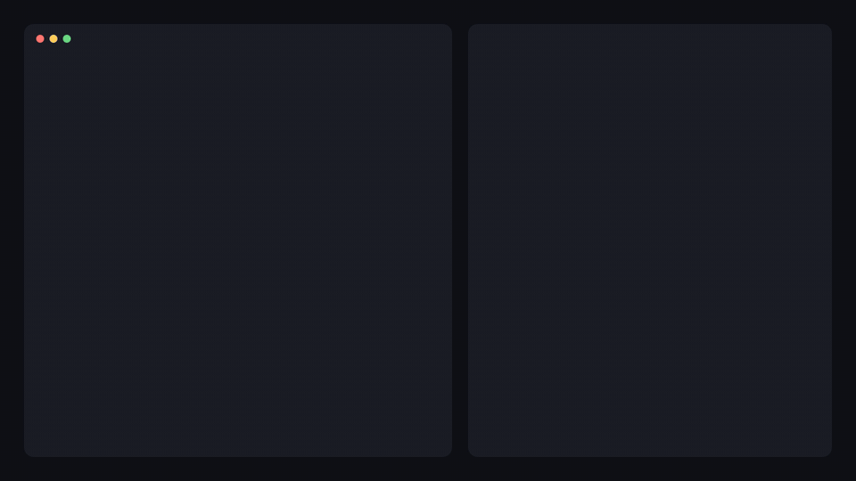
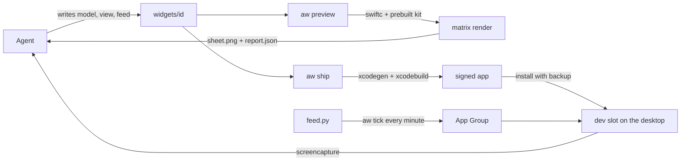

<p align="center">
  
</p>

<h1 align="center">agent-widgets</h1>

<p align="center"><b>Native macOS desktop widgets, built by AI agents.</b></p>

<p align="center">
  <a href="https://github.com/Surdeddd/agent-widgets/actions/workflows/ci.yml"></a>
  
  
  
</p>

<p align="center"><a href="README.ru.md">Русская версия</a></p>

Coding agents write good SwiftUI, but they cannot see WidgetKit. **agent-widgets** gives them eyes and hands. The agent writes only what is unique — a Codable model, a SwiftUI view and, for live data, a small feed script. The `aw` CLI does the rest: it renders every size and theme into one sheet with layout checks, builds and signs the app, installs it, shows the widget in a dev slot on your desktop and captures the real window so the agent can look at it.

<p align="center">
  
</p>

## What you get

- **A preview the agent can trust.** Every family × light / dark × idle desktop × sample, rendered in about a second, with `OVERFLOW`, `TRUNCATION`, `DECODE` and other checks. Every issue comes with a hint, and `aw explain` goes deeper.
- **Real WidgetKit, not a mockup.** `aw ship` builds a signed app, swaps it into `/Applications` with a backup, points the dev slot at the widget and screenshots the real window.
- **Live data.** Feeds in any language print JSON; `aw` checks it against the model, publishes only real changes and schedules feeds with a LaunchAgent.
- **Interactive widgets.** Buttons with state — next, previous, toggles, counters, shuffled decks — that do not spend the reload budget.
- **Made for agents.** An MCP server whose preview tool returns the sheet as an image, a skill with components, recipes and gotchas, `--json` on every command.
- **Bilingual.** Every message and every doc in English and Russian.

## Requirements

- macOS 14 or newer, Xcode 16.3 or newer
- `brew install xcodegen`
- An Apple Development certificate, and a free Apple ID is enough — no paid developer membership: Xcode → Settings → Accounts → + → Apple ID, select its "(Personal Team)" → Manage Certificates → + → Apple Development; in an existing workspace then run `aw init --refresh-signing`. Widgets need the certificate for their App Group. `aw preview` works without any certificate. The free-account path is still being confirmed end to end.

## Install

```sh
git clone https://github.com/Surdeddd/agent-widgets
cd agent-widgets
make install      # installs aw into ~/.local/bin — make sure it is on your PATH
aw doctor
```

## Quick start

```sh
aw init ~/Widgets && cd ~/Widgets
aw new weather --template metric
aw preview weather        # writes .aw/previews/weather/sheet.png
aw ship weather           # build, install, dev slot, real screenshot
```

The first time, add “<App name> · Dev” to your desktop: right-click the desktop → Edit Widgets → search for the app. From then on `aw ship` and `aw dev` switch that slot to whatever you are building.

## Use it from an agent

**Claude Code**

```sh
aw skill install
claude mcp add -s user agent-widgets -- aw mcp --workspace ~/Widgets
```

Then ask: “make me a desktop widget with the weather in Bangkok”.

**Codex** — `~/.codex/config.toml`

```toml
[mcp_servers.agent-widgets]
command = "/Users/you/.local/bin/aw"
args = ["mcp", "--workspace", "/Users/you/Widgets"]
```

**Cursor** (`~/.cursor/mcp.json`) and **Gemini CLI** (`~/.gemini/settings.json`)

```json
{
  "mcpServers": {
    "agent-widgets": {
      "command": "/Users/you/.local/bin/aw",
      "args": ["mcp", "--workspace", "/Users/you/Widgets"]
    }
  }
}
```

Agents without MCP can use the same loop from a shell; `aw skill install` also links the skill into `~/.codex/skills` and `~/.agents/skills` when those folders exist.

## Examples

The [`examples`](examples) workspace holds eight widgets. Each was written by a fresh agent from a one-paragraph brief and the skill, then given one design review pass. The images are `aw preview` renders.

**[system-pulse](examples/widgets/system-pulse)** — CPU, memory, disk and battery of this Mac


**[weather](examples/widgets/weather)** — Bangkok now and the next hours, as a timeline from Open-Meteo


**[github](examples/widgets/github)** — stars, forks and issues of a repository, with a star trend


**[focus](examples/widgets/focus)** — a Pomodoro timer you control from the widget


**[habits](examples/widgets/habits)** — a week of habits you tick right on the desktop


**[flashcards](examples/widgets/flashcards)** — English–Russian cards with next, previous and shuffle


**[fx](examples/widgets/fx)** — USD to EUR, GBP, JPY and THB with 30-day trends


**[world-clock](examples/widgets/world-clock)** — four cities with analog clocks drawn in SwiftUI


## How it works



- `aw preview` compiles the widget's Swift files against a prebuilt copy of the kit and renders every family, appearance, desktop mode and sample with `ImageRenderer`, then measures the layout.
- `aw ship` generates the WidgetKit extension (one `Widget` per widget, plus the dev slot), builds it with Xcode, swaps it into `/Applications`, points the dev slot at the widget and waits for the desktop to redraw before capturing it.
- Data lives in the App Group: feeds write it, widgets read it, buttons keep their state there.

## Commands

| command | does |
|---|---|
| `aw init [dir]` | create a workspace and detect signing |
| `aw new <id> --template t` | scaffold a widget from `metric`, `list`, `ring`, `chart`, `card`, `image`, `timer` or `blank` |
| `aw preview <id>` | render the sheet and check the layout |
| `aw ship <id>` | preview → build → install → dev slot → screenshot |
| `aw build` · `aw install` · `aw rollback` | build and install the app, with backups |
| `aw dev <id>` · `aw shot` · `aw geometry` | switch the dev slot, capture real windows, measure desktop widget sizes |
| `aw feed run <id>` · `aw data set <id>` · `aw data get <id>` | run a feed, push data, read data |
| `aw tick` · `aw daemon install` · `aw logs <id>` | keep feeds running and read their logs |
| `aw doctor` · `aw list` · `aw explain [CODE]` | health, widgets, issue codes |
| `aw mcp` · `aw skill install` | serve agents over MCP, install the skill |

Every command accepts `--json` and `--lang en|ru`.

## What WidgetKit does not allow

- Widgets are snapshots: no networking, timers or free animation in the view. Feeds fetch; the timeline moves; `Text(date, style:)` ticks.
- macOS gives a widget roughly 40–70 reloads a day; keep feeds at 15 minutes or slower. Button taps do not count.
- Only a person can place a widget on the desktop, so the dev slot is added by hand once.
- Previews draw a neutral glass background; the real desktop tints widgets with your wallpaper.

## Development

See [AGENTS.md](AGENTS.md) for the layout and rules. `swift test`, `swift test --package-path Kit` and `swiftlint --strict` must stay green.

## License

[MIT](LICENSE) © 2026 Surdeddd
