<p align="center">
  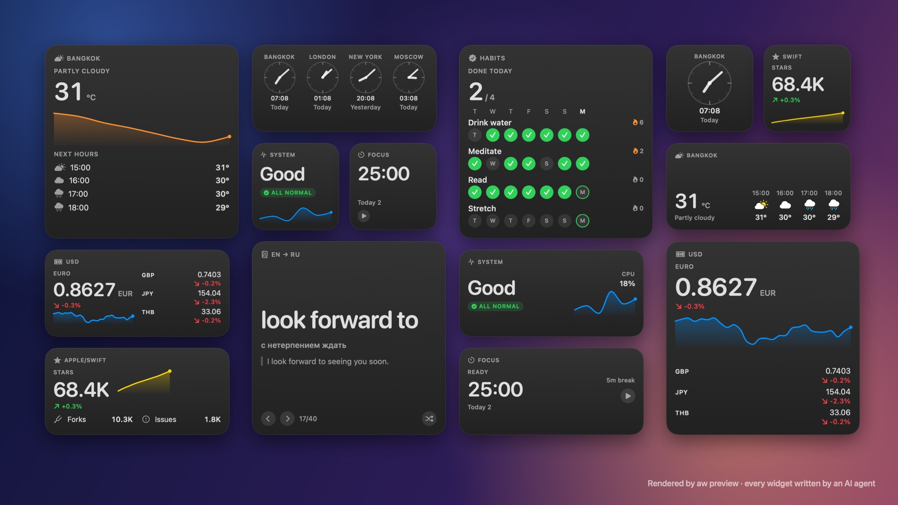
</p>

<h1 align="center">agent-widgets</h1>

<p align="center"><b>Нативные виджеты рабочего стола macOS, которые делают AI-агенты.</b></p>

<p align="center">
  <a href="https://github.com/Surdeddd/agent-widgets/actions/workflows/ci.yml"></a>
  
  
  
</p>

<p align="center"><a href="README.md">English version</a></p>

Агенты хорошо пишут SwiftUI, но не видят WidgetKit. **agent-widgets** даёт им глаза и руки. Агент пишет только своё — Codable-модель, SwiftUI-вьюху и, если нужны живые данные, маленький feed-скрипт. Остальное делает CLI `aw`: рендерит все размеры и темы на один лист с проверками вёрстки, собирает и подписывает приложение, ставит его, показывает виджет в dev-слоте на твоём столе и снимает настоящее окно, чтобы агент на него посмотрел.

<p align="center">
  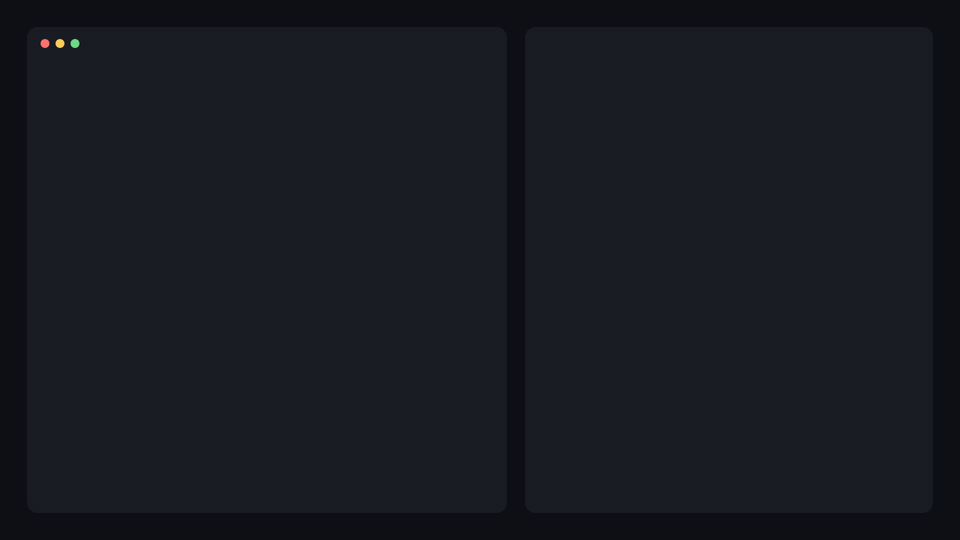
</p>

## Что внутри

- **Превью, которому агент может верить.** Каждый размер × светлая / тёмная тема × стол без фокуса × сэмпл примерно за секунду, с проверками `OVERFLOW`, `TRUNCATION`, `DECODE` и другими. У каждой проблемы есть подсказка, `aw explain` расскажет подробнее.
- **Настоящий WidgetKit, а не макет.** `aw ship` собирает подписанное приложение, подменяет его в `/Applications` с бэкапом, направляет dev-слот на виджет и снимает реальное окно.
- **Живые данные.** Feed на любом языке печатает JSON; `aw` сверяет его с моделью, публикует только настоящие изменения и запускает по расписанию через LaunchAgent.
- **Интерактивные виджеты.** Кнопки с состоянием — вперёд, назад, переключатели, счётчики, перемешанные колоды — не тратят бюджет перезагрузок.
- **Сделано для агентов.** MCP-сервер, у которого превью возвращает лист картинкой, скилл с компонентами, рецептами и граблями, `--json` у каждой команды.
- **Двуязычно.** Каждое сообщение и каждый документ — на английском и русском.

## Что нужно

- macOS 14 или новее, Xcode 16.3 или новее
- `brew install xcodegen`
- Сертификат подписи Apple Development (Xcode → Settings → Accounts). Он нужен виджетам для App Group; бесплатный Apple ID пока не проверяли.

## Установка

```sh
git clone https://github.com/Surdeddd/agent-widgets
cd agent-widgets
make install      # ставит aw в ~/.local/bin — проверь, что он есть в PATH
aw doctor
```

## Быстрый старт

```sh
aw init ~/Widgets && cd ~/Widgets
aw new weather --template metric
aw preview weather        # пишет .aw/previews/weather/sheet.png
aw ship weather           # сборка, установка, dev-слот, настоящий снимок
```

В первый раз добавь на стол «<Имя приложения> · Dev»: правый клик по столу → «Изменить виджеты» → найди приложение. Дальше `aw ship` и `aw dev` сами переключают этот слот на то, над чем идёт работа.

## Подключить к агенту

**Claude Code**

```sh
aw skill install
claude mcp add -s user agent-widgets -- aw mcp --workspace ~/Widgets
```

И попроси: «сделай виджет погоды в Бангкоке на рабочий стол».

**Codex** — `~/.codex/config.toml`

```toml
[mcp_servers.agent-widgets]
command = "/Users/you/.local/bin/aw"
args = ["mcp", "--workspace", "/Users/you/Widgets"]
```

**Cursor** (`~/.cursor/mcp.json`) и **Gemini CLI** (`~/.gemini/settings.json`)

```json
{
  "mcpServers": {
    "agent-widgets": {
      "command": "/Users/you/.local/bin/aw",
      "args": ["mcp", "--workspace", "/Users/you/Widgets"]
    }
  }
}
```

Агенты без MCP проходят тот же цикл из терминала; `aw skill install` ещё и линкует скилл в `~/.codex/skills` и `~/.agents/skills`, если такие папки есть.

## Примеры

В workspace [`examples`](examples) восемь виджетов. Каждый написал свежий агент по одному абзацу брифа и скиллу, потом один проход дизайн-ревью. Картинки — рендер `aw preview`.

**[system-pulse](examples/widgets/system-pulse)** — процессор, память, диск и батарея этого мака

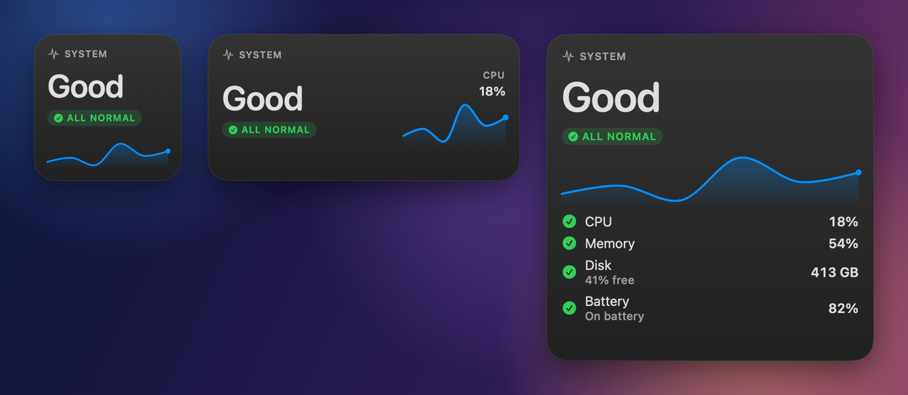

**[weather](examples/widgets/weather)** — Бангкок сейчас и на ближайшие часы — timeline из Open-Meteo

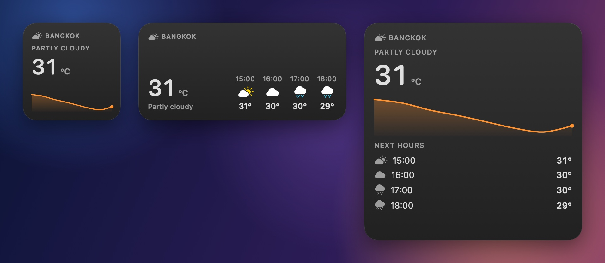

**[github](examples/widgets/github)** — звёзды, форки и issues репозитория с трендом звёзд

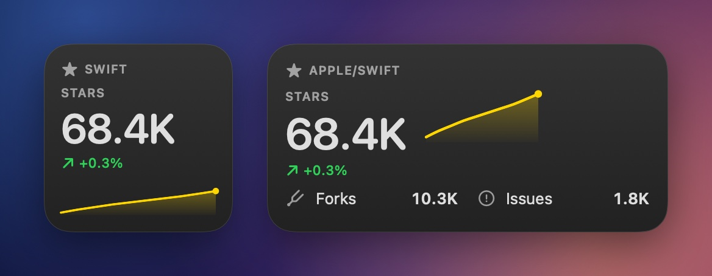

**[focus](examples/widgets/focus)** — помодоро-таймер, которым управляешь прямо из виджета

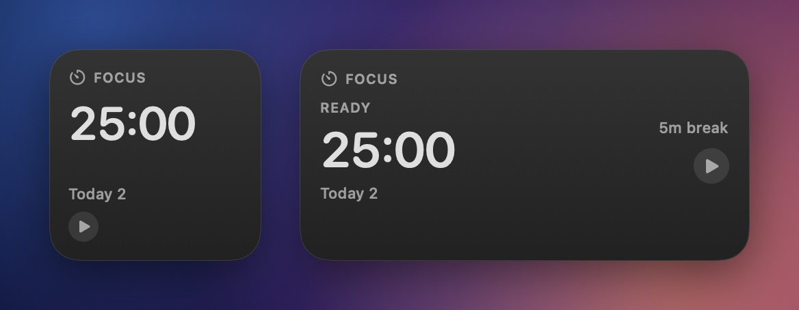

**[habits](examples/widgets/habits)** — неделя привычек, отмечаешь прямо на столе

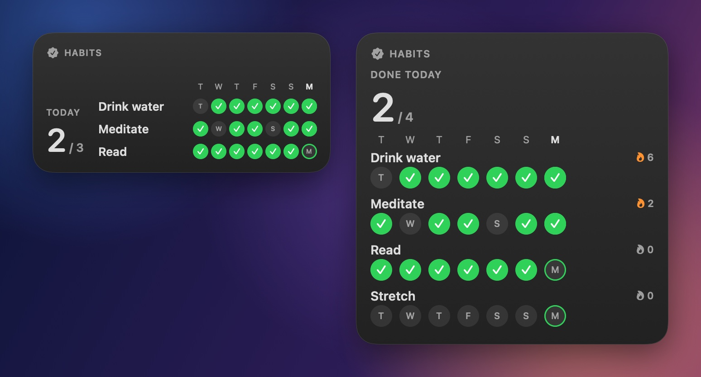

**[flashcards](examples/widgets/flashcards)** — англо-русские карточки: вперёд, назад, перемешать

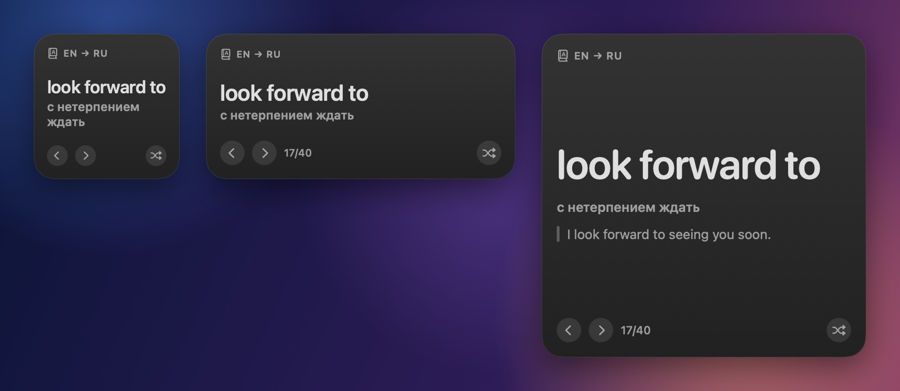

**[fx](examples/widgets/fx)** — курс доллара к EUR, GBP, JPY и THB с трендом за 30 дней

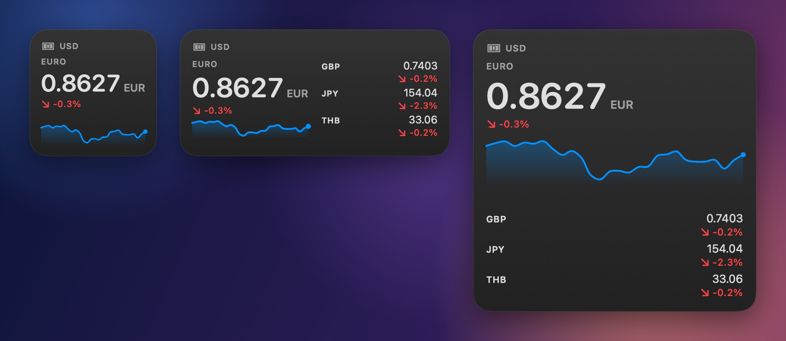

**[world-clock](examples/widgets/world-clock)** — четыре города со стрелочными часами на SwiftUI

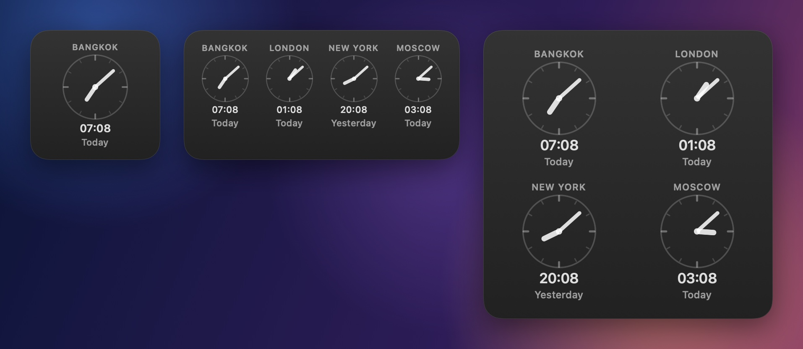

## Как это устроено

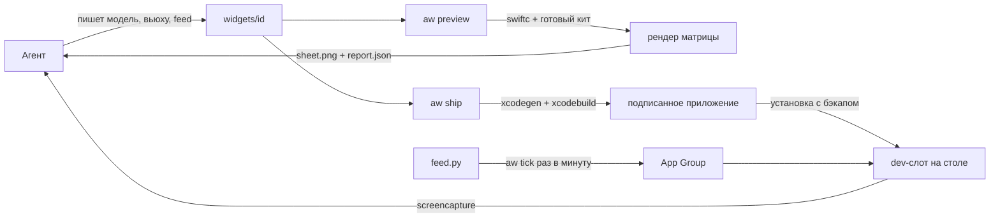

- `aw preview` компилирует Swift-файлы виджета с заранее собранным китом и рендерит через `ImageRenderer` каждый размер, тему, режим стола и сэмпл, затем меряет вёрстку.
- `aw ship` генерирует расширение WidgetKit (свой `Widget` на каждый виджет плюс dev-слот), собирает его Xcode, подменяет приложение в `/Applications`, направляет dev-слот на виджет и ждёт перерисовки стола, прежде чем снять окно.
- Данные живут в App Group: feed их пишет, виджеты читают, кнопки хранят там своё состояние.

## Команды

| команда | что делает |
|---|---|
| `aw init [dir]` | создать workspace и найти подпись |
| `aw new <id> --template t` | виджет из шаблона `metric`, `list`, `ring`, `chart`, `card`, `image`, `timer` или `blank` |
| `aw preview <id>` | отрендерить лист и проверить вёрстку |
| `aw ship <id>` | превью → сборка → установка → dev-слот → снимок |
| `aw build` · `aw install` · `aw rollback` | собрать и поставить приложение, с бэкапами |
| `aw dev <id>` · `aw shot` · `aw geometry` | переключить dev-слот, снять реальные окна, замерить размеры виджетов на столе |
| `aw feed run <id>` · `aw data set <id>` · `aw data get <id>` | прогнать feed, пушнуть данные, прочитать данные |
| `aw tick` · `aw daemon install` · `aw logs <id>` | держать feed'ы свежими и читать их логи |
| `aw doctor` · `aw list` · `aw explain [CODE]` | здоровье, виджеты, коды проблем |
| `aw mcp` · `aw skill install` | отдать агентам по MCP, поставить скилл |

Каждая команда понимает `--json` и `--lang en|ru`.

## Чего WidgetKit не позволяет

- Виджет — это снимок: во вьюхе нет сети, таймеров и свободной анимации. Данные приносит feed, время двигает timeline, `Text(date, style:)` тикает сам.
- macOS даёт виджету примерно 40–70 перезагрузок в сутки; держи feed'ы не чаще раза в 15 минут. Нажатия кнопок не считаются.
- Поставить виджет на стол может только человек, поэтому dev-слот добавляется руками один раз.
- Превью рисует нейтральное стекло; на настоящем столе виджеты подкрашиваются обоями.

## Разработка

Структура и правила — в [AGENTS.md](AGENTS.md). `swift test`, `swift test --package-path Kit` и `swiftlint --strict` должны оставаться зелёными.

## Лицензия

[MIT](LICENSE) © 2026 Surdeddd
