<p align="center">
  
</p>

<h1 align="center">agent-widgets</h1>

<p align="center"><b>Нативные виджеты рабочего стола macOS, которые делает твой AI-агент.</b></p>

<p align="center">
  <a href="https://github.com/Surdeddd/agent-widgets/releases"></a>
  <a href="https://www.npmjs.com/package/agent-widgets"></a>
  <a href="https://github.com/Surdeddd/agent-widgets/actions/workflows/ci.yml"></a>
  
  
  
</p>

<p align="center"><a href="README.md">English version</a></p>

Скажи, что хочешь видеть на рабочем столе. Твой агент — Claude Code, Codex, Cursor, Claude Desktop — пишет маленькую SwiftUI-вьюху и feed-скрипт, а `aw` превращает их в настоящий виджет WidgetKit: рендерит все размеры и темы с проверками вёрстки, собирает и подписывает приложение, ставит его и показывает агенту снимок настоящего стола, чтобы тот исправил увиденное.

А можно ничего не писать: семь виджетов готовы к установке.

## Лимиты AI на столе за минуту

<p align="center">
  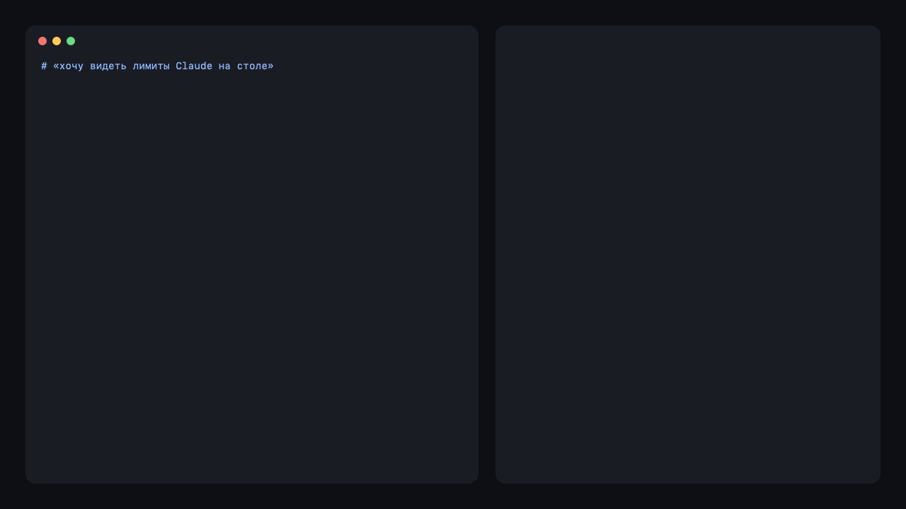
</p>

```sh
brew install surdeddd/tap/agent-widgets     # или: npm install -g agent-widgets
aw init ~/Widgets && cd ~/Widgets
aw gallery add ai-limits && aw feed run ai-limits && aw ship ai-limits
```

Или скажи агенту: *«хочу видеть лимиты Claude и Codex на рабочем столе»* — с подключённым MCP-сервером он сам найдёт галерею.

## Галерея

`aw gallery` показывает список, `aw gallery add <id>` копирует виджет в твой workspace вместе с feed, сэмплами и тестами. Каждый виджет — обычные SwiftUI и Python, которые можно читать и менять. Картинки — рендеры `aw preview`; лимиты AI, GitHub и пульс системы показывают живые данные, остальные — свои сэмплы.

**[ai-limits](examples/widgets/ai-limits)** — сколько осталось в окнах Claude и Codex, когда они сбросятся, как быстро ты их расходуешь относительно ровного темпа, когда лимит кончится при таком темпе, и история за неделю. Спрашивает у Anthropic твой собственный расход тем входом, который уже есть у Claude Code, а лимиты Codex читает из его локальных логов — никаких третьих сторон и лишних ключей.

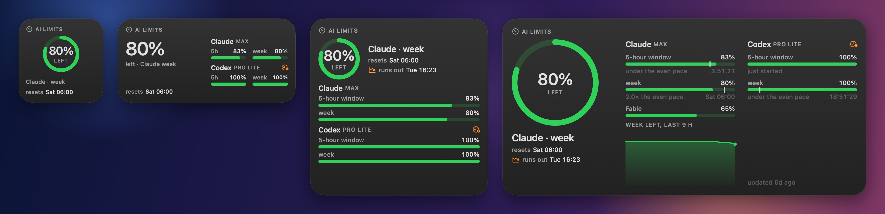

**[agents](examples/widgets/agents)** — какие сессии Claude Code и Codex ждут тебя, затихли или работают, с живыми таймерами и сессиями за последние часы.

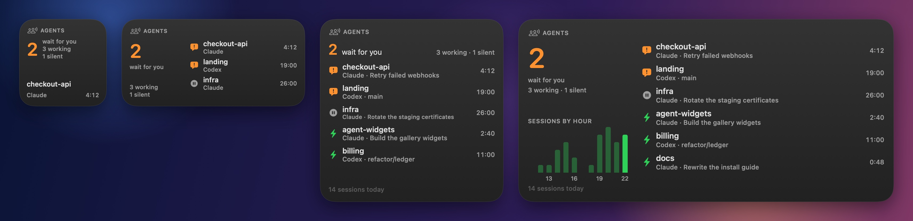

**[github](examples/widgets/github)** — твой год вкладов, серия, очередь ревью и последние 14 дней — через `gh`, которым ты и так пользуешься.

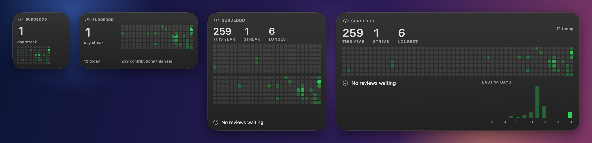

**[ai-spend](examples/widgets/ai-spend)** — сколько стоили бы твои токены Claude Code по ценам API: сегодня, за неделю, за месяц, по моделям, и во сколько раз окупается подписка.

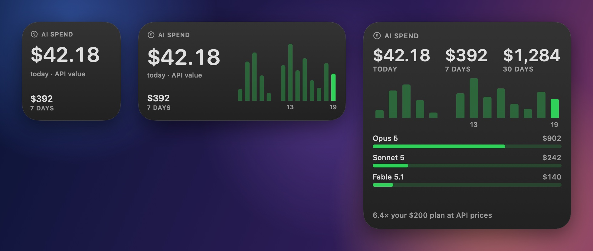

**[tiles](examples/widgets/tiles)** — 2048 прямо на рабочем столе: каждая стрелка — полный ход, приложение не открывается.

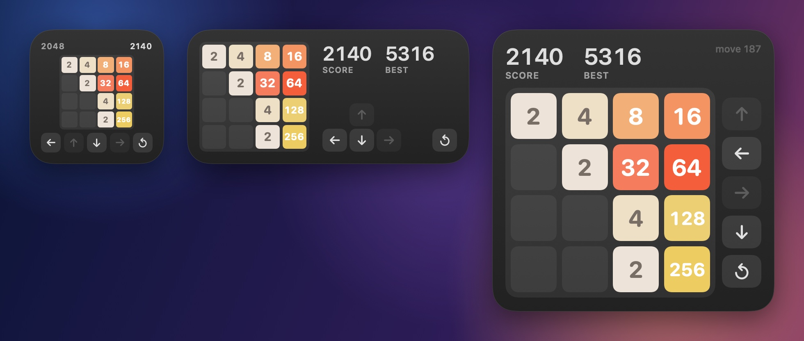

**[system-pulse](examples/widgets/system-pulse)** — процессор, память, диск и батарея с предупреждением, которое читается и без цвета.

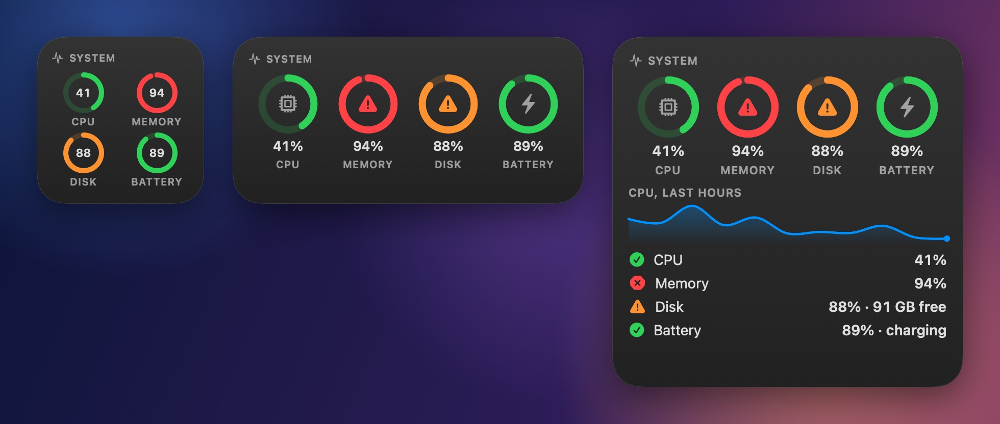

**[focus](examples/widgets/focus)** — помодоро-таймер, который запускается, ставится на паузу и сбрасывается с виджета.

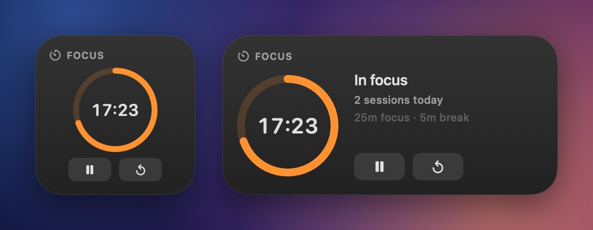

## Собери свой

Агенты хорошо пишут SwiftUI, но не видят WidgetKit. `aw` даёт им глаза и руки. Агент пишет только своё — Codable-модель, вьюху и, если нужны живые данные, feed — и получает ответ, с которым можно работать.

<p align="center">
  
</p>

- **Превью, которому агент может верить.** Каждый размер × светлая / тёмная тема / стол без фокуса / прозрачное стекло Tahoe × сэмпл, в настоящих размерах виджетов этого мака, примерно за секунду, с проверками `OVERFLOW`, `TRUNCATION`, `DECODE` и другими. У каждой проблемы есть подсказка, `aw explain` расскажет подробнее.
- **Большие виджеты, которые оправдывают свой размер.** Превью измеряет наибольшую пустую область в каждом размере и предупреждает кодом `UNDERFILLED`; скилл учит лестнице — каждый размер отвечает на вопрос побольше — вместо одной раскладки, растянутой на четыре размера. На одном и том же брифе свежий агент прошёл путь от 71 % пустоты в extra large до 15 %.
- **Настоящий WidgetKit, а не макет.** `aw ship` собирает подписанное приложение, подменяет его в `/Applications` с бэкапом, направляет dev-слот на виджет и снимает реальное окно.
- **Живые данные, которые берегут бюджет.** Feed на любом языке печатает JSON; `aw` сверяет его с моделью, публикует только настоящие изменения и запускает по расписанию через LaunchAgent. Изменение доезжает до стола примерно за секунду после публикации.
- **Интерактивные виджеты.** Кнопки с состоянием — ходы, переключатели, счётчики, перемешанные колоды — не тратят бюджет перезагрузок.
- **Сделано для агентов.** MCP-сервер, у которого превью возвращает лист картинкой, а длинные вызовы отдают id задания, а не обрываются по таймауту, скилл с компонентами, рецептами и граблями, и плагин Claude Code, который ставит и то и другое сразу.
- **Двуязычно.** Каждое сообщение, каждый виджет и каждый документ — на английском и русском.

```sh
aw new weather --template metric
aw preview weather        # пишет .aw/previews/weather/sheet.png
aw ship weather           # сборка, установка, dev-слот, настоящий снимок
```

В первый раз добавь «<Имя приложения> · Dev» на рабочий стол: правый клик по столу → «Изменить виджеты» → найди приложение. Дальше `aw ship` и `aw dev` переключают этот слот на то, что ты сейчас делаешь.

## Установка

| | |
|---|---|
| **Homebrew** — собирает из исходников твоим Xcode | `brew install surdeddd/tap/agent-widgets` |
| **npm** — готовый универсальный бинарь | `npm install -g agent-widgets` |
| **Claude Desktop** — один файл, без терминала | скачай `agent-widgets-<версия>.mcpb` из [последнего релиза](https://github.com/Surdeddd/agent-widgets/releases/latest) и открой его |
| **Из исходников** | `git clone https://github.com/Surdeddd/agent-widgets && cd agent-widgets && make install` |

Дальше `aw doctor` проверит остальное.

**Что нужно:** macOS 14 или новее, Xcode 16.3 или новее, `brew install xcodegen` и сертификат Apple Development — бесплатного Apple ID достаточно, платная подписка не нужна: Xcode → Settings → Accounts → + → Apple ID, выбери его «(Personal Team)» → Manage Certificates → + → Apple Development; в уже существующем workspace затем запусти `aw init --refresh-signing`. Сертификат нужен виджетам для App Group; `aw preview` работает и без него. Все виджеты в этом репозитории собраны, подписаны и установлены с бесплатной Personal Team.

## Подключение к агенту

**Claude Code** — плагин приносит и скилл, и MCP-сервер:

```text
/plugin marketplace add Surdeddd/agent-widgets
/plugin install agent-widgets@agent-widgets
```

Без плагина: `aw skill install` и

```sh
claude mcp add -s user agent-widgets -- npx -y agent-widgets mcp --workspace ~/Widgets
```

**Codex** — `~/.codex/config.toml`

```toml
[mcp_servers.agent-widgets]
command = "npx"
args = ["-y", "agent-widgets", "mcp", "--workspace", "/Users/you/Widgets"]
```

**Cursor** (`~/.cursor/mcp.json`), **Gemini CLI** (`~/.gemini/settings.json`) и любой другой MCP-клиент

```json
{
  "mcpServers": {
    "agent-widgets": {
      "command": "npx",
      "args": ["-y", "agent-widgets", "mcp", "--workspace", "/Users/you/Widgets"]
    }
  }
}
```

Если `aw` поставлен через Homebrew или из исходников — пиши `"command": "aw", "args": ["mcp", "--workspace", "…"]`. Сервер есть в [реестре MCP](https://registry.modelcontextprotocol.io) под именем `io.github.Surdeddd/agent-widgets`.

Папка может быть пустой: `aw_init` её подготовит, `aw_gallery` покажет готовые виджеты. Сборка и установка идут дольше, чем многие клиенты ждут один вызов, — Codex и Claude Desktop обрывают его через 60 с, — поэтому `aw_ship`, `aw_dev`, `aw_slot` и `aw_feed_run` отвечают в пределах 45 с id задания, если ещё не закончили, а `aw_wait` дожидается результата. Claude Code ждёт вызов целиком. `aw mcp --call-budget <секунды>` меняет лимит, `0` снимает его.

Агенты без MCP могут пройти тот же цикл из шелла; `aw skill install` также линкует скилл в `~/.codex/skills` и `~/.agents/skills`, если эти папки есть.

## На настоящем столе

Снято командой `aw ship` с рабочего стола MacBook: настоящие окна WidgetKit, не рендеры. Когда впереди другое приложение, macOS рисует их монохромными — как и предсказывает строка `desktop idle` на каждом листе превью.

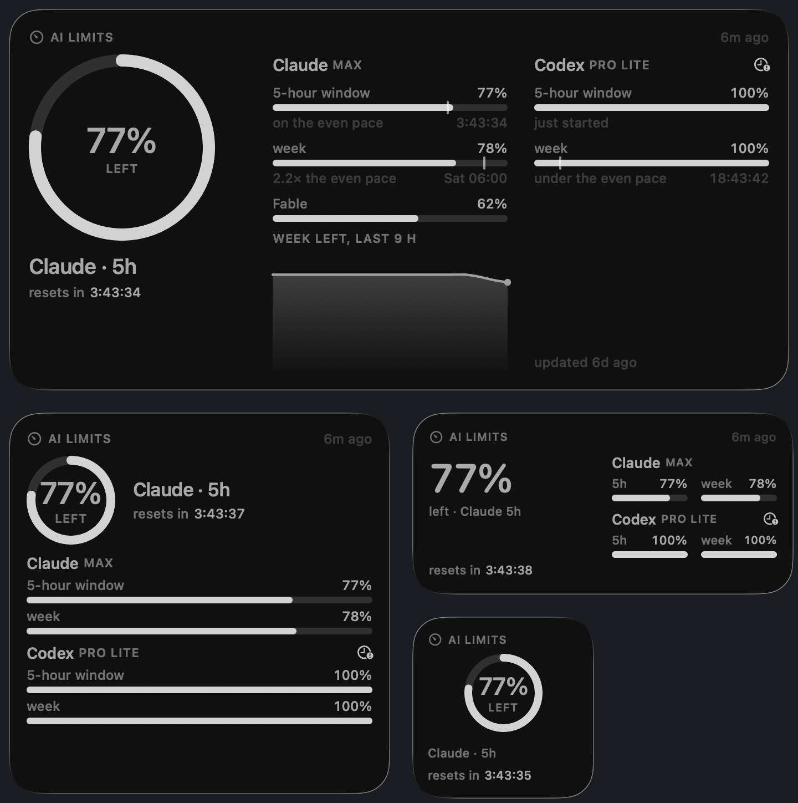

После каждого `aw ship` и `aw dev` слот ставится рядом со своей ячейкой превью: превью, стол и наложение контуров — белое там, где оба совпали, голубое есть только в превью, красное только на столе. Другой сэмпл или состояние роняют совпадение ниже 60 % и дают `SHOT_MISMATCH`.

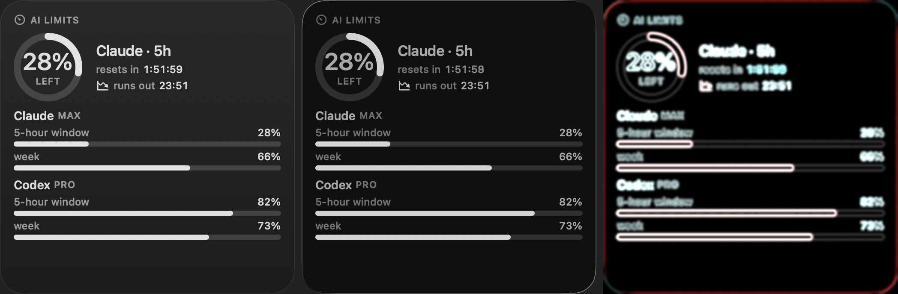

## Как это устроено

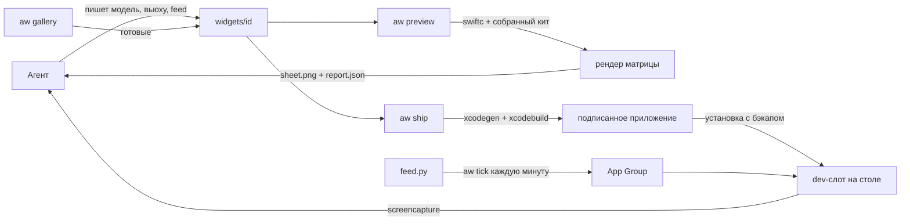

- `aw preview` компилирует Swift-файлы виджета с заранее собранной копией кита и рендерит каждый размер, тему, режим стола и сэмпл через `ImageRenderer`, затем измеряет вёрстку: переполнение, обрезку и пустое место.
- `aw ship` генерирует расширение WidgetKit (по одному `Widget` на виджет плюс dev-слот), собирает его Xcode, подменяет в `/Applications`, направляет dev-слот на виджет и ждёт перерисовки стола перед съёмкой.
- Данные живут в App Group: feed пишет их туда, виджеты читают, кнопки держат там состояние, и настройки виджетов из окна приложения лежат там же.

## Команды

| команда | что делает |
|---|---|
| `aw init [dir]` | создать workspace и найти подпись |
| `aw gallery` · `aw gallery add <id>` | список готовых виджетов, копия одного из них в workspace |
| `aw new <id> --template t` | каркас виджета из `metric`, `list`, `ring`, `chart`, `card`, `image`, `timer` или `blank` |
| `aw preview <id>` | отрендерить лист и проверить вёрстку |
| `aw ship <id>` | превью → сборка → установка → dev-слот → снимок |
| `aw build` · `aw install` · `aw rollback` | собрать и поставить приложение, с бэкапами |
| `aw dev <id>` · `aw shot` · `aw slot` · `aw geometry` | переключить dev-слот, снять настоящие окна, дождаться, пока человек поставит слот, измерить размеры виджетов на столе |
| `aw feed run <id>` · `aw data set <id>` · `aw data get <id>` | запустить feed, положить данные, прочитать данные |
| `aw tick` · `aw daemon install` · `aw logs <id>` | держать feed-ы запущенными и читать их логи |
| `aw doctor` · `aw list` · `aw explain [CODE]` | здоровье, виджеты, коды проблем |
| `aw mcp [--call-budget s]` · `aw skill install` | MCP-сервер для агентов, установка скилла |

Каждая команда понимает `--json` и `--lang en|ru`.

## Чего WidgetKit не разрешает

- Виджеты — это снимки: никакой сети, таймеров и свободной анимации во вьюхе. Данные приносит feed; движется таймлайн; тикает `Text(date, style:)`.
- macOS даёт виджету примерно 40–70 перезагрузок в сутки. `aw` тратит одну, только когда данные действительно изменились, поэтому feed может запускаться хоть каждую минуту, если печатает тот же вывод, пока ничего не произошло. Нажатия кнопок не считаются.
- Поставить виджет на стол может только человек, поэтому dev-слот один раз добавляется руками.
- macOS рисует виджет на столе, только пока он на экране. За окнами dev-слот — пустая рамка, поэтому `aw` отвечает `WIDGET_HIDDEN` и просит показать стол, а не сравнивает пустой снимок.
- Превью рисует нейтральное стекло; настоящий стол подкрашивает виджеты твоими обоями.

## Разработка

Раскладка и правила — в [AGENTS.md](AGENTS.md). `swift test`, `swift test --package-path Kit`, `python3 -B -m unittest discover -s Tests/Feeds` и `swiftlint --strict` должны оставаться зелёными. `scripts/package.sh` собирает npm-пакет и `.mcpb`.

## Лицензия

[MIT](LICENSE) © 2026 Surdeddd
